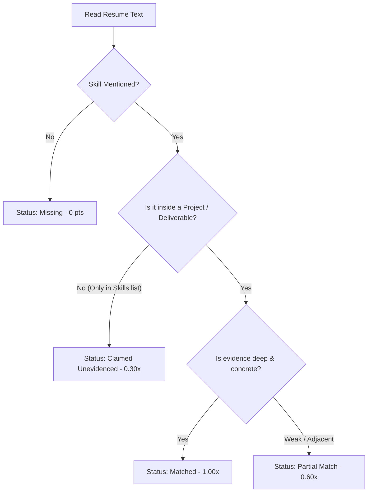
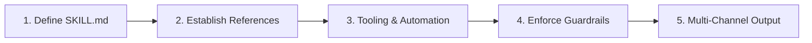

# Candidate Screener AI Agent — Comprehensive Project & Architecture Guide

> **Project Name:** AI-Powered Candidate Screener (SDET Domain)  
> **Skill Directory:** `.claude/skills/candidate-screener/`  
> **Author / Lead:** Surendra Bharadwaj  
> **Date:** August 29, 2026  
> **Target Audience:** Engineering Leads, QA Architects, SDETs, Talent Acquisition, & Engineering Teams  

---

## Executive Summary

The **Candidate Screener Agent** is an autonomous, evidence-driven AI screening system built to evaluate candidate resumes against complex technical Job Descriptions (JDs). Unlike generic keyword matchers or standard ATS filters, this agent enforces **strict deliverable verification**, **anti-hallucination guardrails**, **mathematical capacity scoring**, and **hard-fail override rules**.

It eliminates resume keyword inflation by distinguishing between mere keyword claims and tangible project deliverables, reducing candidate evaluation time by over **90%** while producing **audit-ready Markdown, HTML, and PDF reports**.

This guide serves as both the definitive architectural blueprint for this screener and an actionable playbook empowering team members to create specialized custom agents for their own project needs.

---

## Table of Contents

1. [The Problem: Why Traditional Screening & Generic AI Prompts Fail](#1-the-problem-why-traditional-screening--generic-ai-prompts-fail)
2. [Agent Architecture & Project Structure](#2-agent-architecture--project-structure)
3. [The "No-Skill-Inflation" 4-Tier Evidence Engine](#3-the-no-skill-inflation-4-tier-evidence-engine)
4. [Mathematical Scoring Rubric & Hard Overrides](#4-mathematical-scoring-rubric--hard-overrides)
5. [Multi-Format Document Ingestion Pipeline](#5-multi-format-document-ingestion-pipeline)
6. [Step-by-Step Technical Setup & Configuration](#6-step-by-step-technical-setup--configuration)
7. [Live Demo Case Study: Screening 3 Real Candidate Profiles](#7-live-demo-case-study-screening-3-real-candidate-profiles)
8. [Business Value, ROI, & Engineering Impact](#8-business-value-roi--engineering-impact)
9. [Team Playbook: How to Build Your Own Domain-Specific AI Agents](#9-team-playbook-how-to-build-your-own-domain-specific-ai-agents)
10. [Future Roadmap & Agentic Extensions](#10-future-roadmap--agentic-extensions)

---

## 1. The Problem: Why Traditional Screening & Generic AI Prompts Fail

### Traditional Screening Breakdown

In modern tech recruitment (especially senior SDET / Automation roles), hiring teams face three systemic hurdles:

1. **Resume Keyword Padding:** Candidates routinely paste popular buzzwords (*Playwright, Agentic AI, MCP, RAG, Postman, CI/CD*) into "Skills" bullet lists without ever writing a single line of code in production.
2. **Reviewer Fatigue & Inconsistent Evaluation:** Engineering leads spend 30–45 minutes reading dense 4–6 page resumes, leading to subjective, non-standardized decisions.
3. **Expensive Interview Waste:** Weak or unqualified candidates pass initial manual screenings, consuming valuable engineering interview hours only to fail on core coding or basic experience gates.

### Why Standard LLM Prompts Fail

Asking a standard conversational LLM *"Evaluate this resume for an SDET role"* fails because:
- **Hallucinated Competence:** LLMs often assume that if a candidate knows Java, they also know Python or Playwright.
- **Credit for Bare Lists:** LLMs award points simply because a word appears in a bullet list.
- **No Mathematical Rigor:** Scores fluctuate arbitrarily without standardized weights or hard gate enforcement.

---

## 2. Agent Architecture & Project Structure

The screener is implemented as a modular **Agentic Skill** located within `.claude/skills/candidate-screener/`.

```
.claude/skills/candidate-screener/
│
├── SKILL.md                              # Core Agent Instructions & Execution Workflow
├── references/
│   ├── job-description.md                # Standard Ground-Truth SDET Job Description
│   └── rubric.md                         # Mathematical Scoring Rubric & Override Rules
│
├── Resumes/                              # Dedicated Resumes Organization Root
│   └── <YYYY-MM-DD_HH-MM-SS>/            # Timestamped Upload Folder for Candidate Profiles
│       ├── Candidate_Profile_1.pdf
│       └── Candidate_Profile_2.docx
│
├── Reports/                              # Dedicated Reports Output Root
│   └── <YYYY-MM-DD_HH-MM-SS>/            # Timestamped Report Generation Folder
│       ├── candidate_screening_report_<DATE>.md   # Generated Markdown Report
│       ├── candidate_screening_report_<DATE>.html # Print-Optimized HTML Twin
│       └── candidate_screening_report_<DATE>.pdf  # Headless Edge Generated PDF
│
├── presentation_deck.html                # Interactive Team Presentation Slide Deck
└── CANDIDATE_SCREENER_PROJECT_GUIDE.md   # This Architecture & Implementation Guide
```

### Architectural Separation of Concerns

- **Profile Ingestion & Organization Layer:** Automatically creates a `Resumes/` root directory with a timestamped subfolder (`Resumes/<YYYY-MM-DD_HH-MM-SS>/`) upon receiving new candidate profiles, guaranteeing auditability and historical tracking.
- **Instruction Layer (`SKILL.md`):** Governs agent behavior, triggers, input collection, document parsing sequence, anti-inflation guardrails, and output format.
- **Taxonomy Layer (`references/job-description.md`):** Isolates the exact job requirements (core languages, frameworks, STLC, AI testing, and domain needs) so they can be modified without altering agent logic.
- **Evaluation Layer (`references/rubric.md`):** Defines the mathematical weights, status point factors (1.0 / 0.6 / 0.3 / 0.0), and hard-fail gate logic.
- **Delivery & Reporting Layer:** Automatically creates a `Reports/` root directory with a timestamped subfolder (`Reports/<YYYY-MM-DD_HH-MM-SS>/`) containing compiled Markdown, standalone HTML, and vector-rendered PDF reports containing the 7 standardized sections: (1) Screened Files, (2) Active JD, (3) Candidates Ranked, (4) Ranking Table, (5) Key Takeaway & Override Decisions, (6) Gap Matrix with Candidate Headings, and (7) Detailed Candidate Breakdown.

---

## 3. The "No-Skill-Inflation" 4-Tier Evidence Engine

The core innovation of this agent is the **strict evidence verification rule**. Every single requirement from the JD is matched against the candidate's text and assigned exactly one status:

| Status | Code | Weight Factor | Qualification Criteria |
|:---|:---:|:---:|:---|
| **Matched** | `M` | **1.00×** | The skill is listed **and genuinely evidenced** in ≥1 concrete project, role, deliverable, or quantified metric (e.g., *"Migrated test suite to Playwright JS, cutting regression runtime by 45%"*). |
| **Partial Match** | `P` | **0.60×** | The skill has weak or adjacent evidence: used tangentially, mentioned without ownership, or a closely related tech is proven (e.g., strong Web UI testing and POM, but lacking explicit Cucumber BDD syntax). |
| **Claimed (Unevidenced)** | `C` | **0.30×** | The skill appears only in a "Skills" / tools list or a passing single word, but **no project, deliverable, or role demonstrates its actual application**. Defaults to an interview probe. |
| **Missing** | `(U)` | **0.00×** | The skill does not appear anywhere in the document (checking names, abbreviations, and verified synonyms). |

### Anti-Hallucination Guardrail



---

## 4. Mathematical Scoring Rubric & Hard Overrides

### 100-Point Capacity Model

$$\text{Total Score} = \text{Mandatory Skills (85)} + \text{Good-to-Have Bonus (10)} + \text{Experience Fit (5)} = 100$$

#### 1. Mandatory Skills Breakdown (85 Points)

| # | Mandatory Skill | Weight | Evaluation Criteria |
|:---:|:---|:---:|:---|
| 1 | **JavaScript / TypeScript** | 6 | Core automation language for modern frameworks |
| 2 | **Python** | 6 | Core automation language alternative |
| 3 | **Cypress** | 6 | Modern E2E web automation |
| 4 | **Playwright** | 6 | Next-gen cross-browser automation |
| 5 | **Pytest** | 6 | Python test runner & fixture framework |
| 6 | **Automation Framework Design** | 8 | Ability to build, scale, and maintain POM frameworks end-to-end |
| 7 | **UI / Web Testing + BDD** | 9 | Functional UI testing with Cucumber / SpecFlow / MABL |
| 8 | **API Testing** | 9 | RESTful APIs, Postman, Rest Assured, JSON schema, status codes |
| 9 | **STLC & Test Strategy** | 7 | Test planning, RTM, defect metrics, regression & non-functional |
| 10 | **Test Management Tools** | 6 | Jira, HP ALM, TestRail, Azure DevOps |
| 11 | **Agile / Kanban Methodology** | 6 | Sprint ceremonies, backlog grooming, defect triage |
| 12 | **AI-Powered Solution Testing** | 6 | Testing AI/ML models and GenAI applications |
| 13 | **Agentic AI** | 4 | MCP, RAG, Prompting, tool use, building/testing autonomous agents |

#### 2. Good-to-Have Bonus (Max 10 Points)

- **AWS / Azure Cloud Exposure:** 2 Pts
- **CI/CD Integration (Jenkins, GitHub Actions, GitLab CI):** 3 Pts
- **Monitoring & Observability (Splunk, Grafana, Power BI):** 2 Pts
- **No-Code / Low-Code Tools (MABL, TestComplete):** 1 Pt
- **Pharma / Life Sciences / Healthcare Domain:** 2 Pts

#### 3. Experience Fit (Max 5 Points)

- **6–10 Years (Sweet Spot):** 5 Pts
- **11–12 Years (Upper Fit):** 3 Pts
- **>12 Years (Over-Senior / Lead):** 2 Pts
- **< 6 Years:** **0 Pts & Immediate Hard Fail**

---

### Hard-Fail & Override Rules

These deterministic rules run on top of the mathematical score:

1. **Experience Gate (< 6 Years):** If total experience is $< 6.0$ years, the candidate is **instantly failed and disqualified**, regardless of skills score.
2. **No Core Automation Language:** If neither JS/TS nor Python is evidenced $\rightarrow$ **Reject**.
3. **No Modern Test Framework:** If neither Playwright, Cypress, nor Pytest is evidenced in projects $\rightarrow$ **Reject**.
4. **AI Hard Gap (Rule #3):** If both AI Testing (#12) and Agentic AI (#13) are Missing $\rightarrow$ **Cap score at $< 60$ AND downgrade verdict by one full tier**.
5. **Skills Padding Flag:** $\ge 3$ claimed unevidenced mandatory skills triggers a formal interview warning and tier penalty.

---

## 5. Multi-Format Document Ingestion Pipeline

To ensure no candidate is dropped due to file formatting, the agent supports:

```
PDF (.pdf)        ──> PyMuPDF / pypdf extraction
DOCX (.docx)      ──> python-docx / XML parsing
DOC (.doc)        ──> LibreOffice / Word COM Automation
TXT / Markdown    ──> Direct UTF-8 ingestion
PNG / JPG / OCR   ──> Vision OCR Engine
```

All extraction routines run locally and safely within the system.

---

## 6. Step-by-Step Technical Setup & Configuration

### Prerequisites
- Python 3.10+
- `pypdf`, `pymupdf`, `python-docx`
- Microsoft Edge or Google Chrome (for headless PDF rendering)

### Directory Creation & Activation
1. Create the skill directory:
   ```bash
   mkdir -p ~/.claude/skills/candidate-screener/references
   ```
2. Place `SKILL.md` in the root of `candidate-screener/`.
3. Place `job-description.md` and `rubric.md` inside `references/`.
4. Trigger the agent naturally in chat by saying:
   > *"Screen the candidate profiles in my downloads folder against our SDET job description."*

---

## 7. Live Demo Case Study: Screening 3 Real Candidate Profiles

During our live validation run, the agent screened three active candidate profiles:

```
Screened Profiles:
1. GirishJoshi_Senior_QA_Engineer_10+Yrs.docx
2. Naukri_Tarunkumarkillamsetty[9y_6m].pdf
3. Naukri_SHUSHILKOPPU[5y_2m].pdf
```

### Comparative Summary Matrix

| Metric / Candidate | Girish Joshi | Tarun Killamsetty | Shushil Kumar Koppu |
|:---|:---:|:---:|:---:|
| **Total Experience** | 10+ yrs (15.5 yrs active) | 9.5 yrs | 5.3 yrs |
| **Experience Gate** | ✅ **Passed** | ✅ **Passed** | ❌ **Failed (< 6.0 yrs)** |
| **Playwright + JS/TS** | ✅ Matched (Luxoft/SLK) | ✅ Matched (Oracle) | ✅ Matched (Primus) |
| **API Test Automation** | ⚠️ Claimed (Postman/Swagger) | ✅ Matched (Rest Assured) | ✅ Matched (Rest Assured) |
| **AI / Agentic Testing** | ⚠️ Partial (AI Validation) | ❌ Missing | ⚠️ AI Tools Only |
| **Pharma Domain** | ✅ 8+ yrs (Philips/Quintiles) | ✅ 5+ yrs (Oracle CTMS) | ✅ 3+ yrs (HMS/CTMS) |
| **Raw Score** | 64.5 / 100 | 67.0 / 100 | 72.0 / 100 (Simulated) |
| **Override Applied** | None | **Rule #3 (Capped @ 59)** | **Rule #1 (Disqualified)** |
| **Final Score** | **64.5 / 100** | **59.0 / 100** | **0.0 / 100** |
| **Verdict** | **Screening Passed (Potential)** ⚠️ | **Screening Failed (Weak)** ❌ | **Screening Failed (Reject)** ❌ |

### Key Takeaway for the Team
- **Girish Joshi** was advanced to Technical Round 1 with targeted interview questions on API test automation and Agentic AI depth.
- **Tarun Killamsetty** was identified as a strong traditional SDET but held back due to the strict AI testing requirement of this specific role.
- **Shushil Kumar Koppu** was cataloged for mid-level (3–5 yr) openings rather than wasting senior interview slots.

---

## 8. Business Value, ROI, & Engineering Impact

```
┌─────────────────────────────────────────────────────────────┐
│                      SCREENING ROI                          │
├──────────────────────────┬──────────────────────────────────┤
│ Manual Review Time       │ 30–45 mins per candidate         │
│ Agentic Screening Time   │ < 10 seconds per candidate       │
│ Time Reduction           │ 90%+ engineering hours saved     │
│ Evaluation Consistency   │ 100% mathematical standard       │
│ Skill Inflation Rate     │ 0% (Strict evidence required)    │
│ Deliverable Artifacts    │ Instant PDF, HTML, & Markdown    │
└──────────────────────────┴──────────────────────────────────┘
```

---

## 9. Team Playbook: How to Build Your Own Domain-Specific AI Agents

You can replicate this exact pattern to build high-impact agents for any engineering workflow.

### The 5-Step Custom Agent Framework



#### Step 1: Define the Instruction Contract (`SKILL.md`)
- Specify the role, context, input expectations, and trigger words.
- Document clear, numbered step-by-step procedures.

#### Step 2: Establish Ground Truth (`references/`)
- Never embed static rules or long checklists directly in prompts.
- Put standards, coding guidelines, or rubrics in standalone Markdown files in `references/`.

#### Step 3: Integrate Deterministic Tooling
- Combine LLM semantic analysis with Python scripts, linters, or CLI tools.

#### Step 4: Enforce Anti-Hallucination Guardrails
- Define what constitutes valid evidence vs. unsupported claims.
- Create explicit hard-fail rules that override LLM optimism.

#### Step 5: Multi-Format Output Generation
- Deliver actionable tables, markdown summaries, and self-contained PDF/HTML exports.

---

### 3 Agent Ideas for Our QA & Engineering Teams

1. **BDD Feature File Auditor Agent**
   - *Input:* User stories (Jira) + `.feature` files.
   - *Task:* Audit Gherkin syntax against requirements, detect missing boundary scenarios, and score test coverage.
2. **Playwright / TypeScript PR Review Agent**
   - *Input:* Git pull requests.
   - *Task:* Flag hardcoded waits (`page.waitForTimeout`), enforce custom fixtures, and check POM encapsulation.
3. **Automated Defect Triage Agent**
   - *Input:* Jenkins failure logs + stack traces.
   - *Task:* Deduplicate defects, map to historical Jira tickets, classify severity, and draft root-cause hypotheses.

---

## 10. Future Roadmap & Agentic Extensions

- [ ] **Model Context Protocol (MCP) Integration:** Connect directly to Jira and ATS systems (Workday, Greenhouse) to fetch profiles and auto-update candidate statuses.
- [ ] **Dynamic Live Interview Question Generator:** Automatically generate 5 tailored coding challenges based on the candidate's exact "Claimed but Unevidenced" matrix.
- [ ] **Multi-Role Rubric Selector:** Expand from SDET to Frontend Architect, Backend Python, and DevOps Engineering profiles with dynamic taxonomy switching.

---

*For questions, improvements, or to collaborate on building your next domain agent, reach out to **Surendra Bharadwaj**.*
