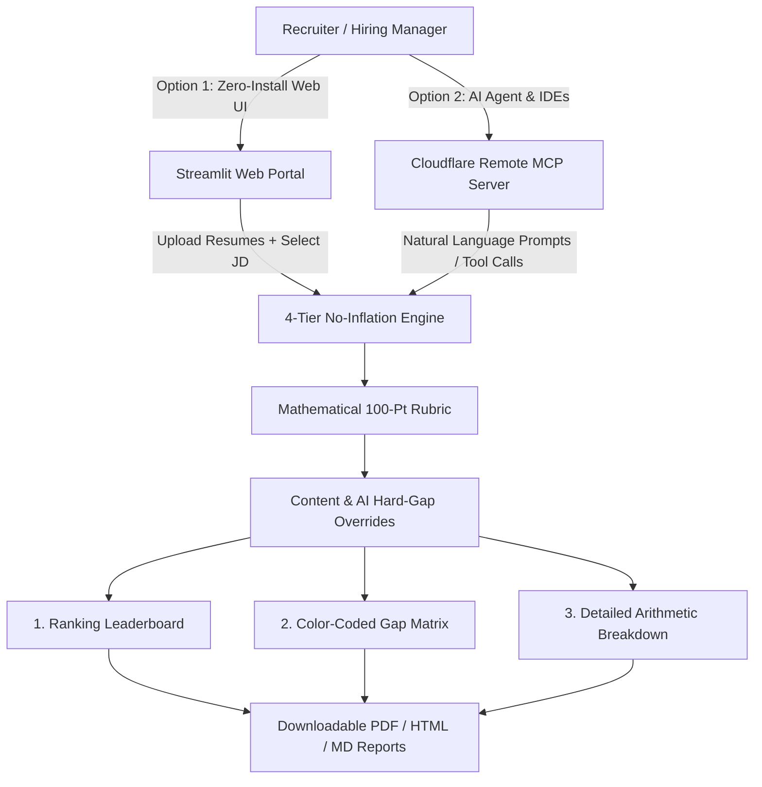

# 📖 AI Candidate Screener — Comprehensive User & Integration Guide

> **An evidence-driven, autonomous ATS screening system for technical recruitment.**  
> Eliminates resume keyword padding through strict deliverable verification, mathematical 100-point capacity scoring, and automated audit-ready PDF/HTML reporting.

---

## 🗺️ Architectural Workflow Overview



---

# 🌐 Pathway 1: Screening via Streamlit Cloud Web Portal

**Public Portal URL:** 🔗 [https://candidate-screener-agent.streamlit.app/](https://candidate-screener-agent.streamlit.app/)

The web portal provides a zero-code, instant web interface accessible from any browser without installing Python or IDEs.

```
+------------------------------------------------------------------------------------+
| 🎯 AI Candidate Screener Portal                                                    |
|                                                                                    |
| [📄 1. Target Job Description (Mandatory)]   [👥 2. Candidate Profiles (Mandatory)]|
| (•) Active Default SDET JD (3–12 Yrs)        [ 📂 Browse files / Drag & Drop       |
| ( ) Upload Custom JD Document                |    Naukri_Tarun[9y_6m].txt          |
|                                              |    Flang_Paulson[8y].docx ]         |
|------------------------------------------------------------------------------------|
|                      [ 🚀 Screen Candidate Profiles ]                              |
+------------------------------------------------------------------------------------+
```

---

### Step-by-Step Instructions:

#### Step 1: Open the Web Portal
1. Open your browser and navigate to: **[https://candidate-screener-agent.streamlit.app/](https://candidate-screener-agent.streamlit.app/)**
2. The page will load with the configured SDET screening engine.

#### Step 2: Set the Target Job Description (Mandatory)
In **Column 1 (Target Job Description)**, choose your JD source:
- **Option A (Default):** Select **"Use Active Default SDET JD (3–12 Yrs, Life Sciences/Pharma)"**.
  - Automatically loads the ground-truth technical rubric covering: Life Sciences domain, JS/TS, Python, Playwright, Cypress/Pytest, Framework Architecture, BDD UI Testing, REST API Testing, AI Testing, and Agentic AI.
  - Click **👁️ View Active Default SDET Requirements** to expand and review all evaluated criteria.
- **Option B (Custom Role):** Select **"Upload Custom Job Description Document"**.
  - Click **Browse files** and upload your role's JD (`.pdf`, `.docx`, `.txt`, or `.md`).
  - The engine dynamically extracts role title, mandatory skills, and secondary preferences.

#### Step 3: Upload Candidate Resumes (Mandatory)
In **Column 2 (Candidate Profiles)**:
1. Click **Browse files** or drag-and-drop 1 or multiple candidate resumes.
2. Supported formats: `.pdf`, `.docx`, `.doc`, `.txt`.
3. The portal will display the number of selected files (e.g., `📁 Selected 4 candidate resume(s)`).

#### Step 4: Run the Screening Engine
1. Click the primary button: **`🚀 Screen Candidate Profiles`**.
2. A progress spinner appears while the system parses resume text, verifies deliverables, checks override gates, and calculates rubric arithmetic.

#### Step 5: Review & Download Reports
Once screening completes, 4 structured report sections appear on screen:

1. **🏆 Ranking Leaderboard:**
   - Comparative table with Candidate Name, Final Score (out of 100), Verdict Badge, Total Experience, Missing Mandatory Skills, and Override Notes.
2. **💡 Key Takeaways & Override Decisions:**
   - High-level executive bullet points highlighting top fits and reasons for any down-rankings.
3. **📊 4-Tier Evidence Gap Matrix:**
   - Expandable candidate panels with color-coded evidence statuses:
     - 🟢 **Matched (1.00×):** Verified in concrete project deliverables.
     - 🟠 **Partial Match (0.60×):** Adjacent tech or minimal exposure.
     - 🔵 **Claimed not evidenced (0.30×):** Keyword list only, no proof.
     - 🔴 **Missing (0.00×):** Not found in resume.
4. **📥 Export & Download Audit Reports:**
   - 📄 **Download Audit PDF Report:** Vector A4 multi-page document with headers, footers, color status tags, and score breakdowns.
   - 🌐 **Download HTML Twin:** Standalone responsive web report for email sharing or archiving.
   - 📝 **Download Markdown Report:** Raw markdown report for internal ATS ingestion or GitHub repositories.

---

# ⚡ Pathway 2: Screening via Cloudflare MCP Server

**Live Cloudflare SSE Endpoint:** 🔗 `https://obtaining-euro-substantial-unnecessary.trycloudflare.com/sse`  
**Standalone GitHub Repository:** 🔗 [https://github.com/surendra1220/candidate-screener-mcp](https://github.com/surendra1220/candidate-screener-mcp)

The Model Context Protocol (MCP) server allows AI assistants (**Google Antigravity IDE**, **VS Code Copilot / Cline / Cursor**, **Claude Desktop**) to natively call the screening tools and resources during chat conversations.

---

### Step 1: Add the MCP Server Configuration

#### A. In Google Antigravity IDE
1. Open or create your global config file:
   📁 **`C:\Users\<username>\.gemini\config\mcp_config.json`** *(or `~/.gemini/config/mcp_config.json`)*
2. Paste the following valid JSON:

```json
{
  "mcpServers": {
    "candidate-screener-cloud": {
      "serverUrl": "https://obtaining-euro-substantial-unnecessary.trycloudflare.com/sse"
    }
  }
}
```

> **UI Alternative in Antigravity IDE:**
> 1. Click **Additional Options (`...`)** at the top right of the IDE.
> 2. Select **MCP Servers** $\rightarrow$ Click **Add Server**.
> 3. Enter Server Name: `candidate-screener-cloud` and Server URL: `https://obtaining-euro-substantial-unnecessary.trycloudflare.com/sse`.

---

#### B. In Visual Studio Code (Copilot Agent Mode / Cline / Cursor / Roo-Code)
Add to your project's `.vscode/mcp.json`:

```json
{
  "mcpServers": {
    "candidate-screener-cloud": {
      "serverUrl": "https://obtaining-euro-substantial-unnecessary.trycloudflare.com/sse"
    }
  }
}
```

---

#### C. In Claude Desktop
Add to `%APPDATA%\Claude\claude_desktop_config.json` (Windows) or `~/Library/Application Support/Claude/claude_desktop_config.json` (macOS):

```json
{
  "mcpServers": {
    "candidate-screener-cloud": {
      "serverUrl": "https://obtaining-euro-substantial-unnecessary.trycloudflare.com/sse"
    }
  }
}
```

---

### Step 2: Verify Discovered Tools

Once connected, your AI assistant will automatically gain access to 4 native tools and 2 resources:

| Type | Name | Purpose |
| :--- | :--- | :--- |
| **Tool** | `screen_candidate` | Evaluates a single candidate's resume text against the active JD. |
| **Tool** | `screen_batch_resumes` | Evaluates multiple resumes and generates a sorted leaderboard. |
| **Tool** | `get_job_description` | Retrieves active ground-truth requirements. |
| **Tool** | `get_scoring_rubric` | Retrieves capacity model, weights, and override rules. |
| **Resource** | `screener://job-description` | Ground-truth technical JD document. |
| **Resource** | `screener://rubric` | 100-point capacity scoring model. |

---

### Step 3: Example Prompts to Screen Candidates

Once configured, simply chat naturally with your AI assistant:

#### Prompt 1: Screening a Single Resume
> *"Using the candidate-screener MCP server, screen the attached resume for 'Tarun Killamsetty' against our default SDET job description and provide the Gap Matrix and verdict."*

#### Prompt 2: Batch Screening Multiple Resumes
> *"Please screen all candidate resumes in my `Resumes/` folder using `screen_batch_resumes` and generate a ranked leaderboard with score breakdowns."*

#### Prompt 3: Custom Role Evaluation
> *"Here is a custom Job Description for a Lead Automation Engineer: `[Paste JD text]`. Evaluate candidate 'Shushil Koppu' against this custom JD using the 4-tier no-inflation engine."*

#### Prompt 4: Checking Ground-Truth Criteria
> *"Show me the active SDET job description and scoring rubric weights using the screener tools."*

---

# ⚖️ Feature Comparison Matrix

| Capability | 🌐 Streamlit Web Portal | ⚡ Cloudflare MCP Server |
| :--- | :---: | :---: |
| **Access Method** | Web Browser (`.app` URL) | AI IDEs / Claude / Cursor / Copilot |
| **Prerequisites** | None (Zero Installation) | MCP-compatible client |
| **Multi-Resume Batching** | ✅ Drag & drop batch upload | ✅ Batch JSON list or folder ingestion |
| **Custom JD Upload** | ✅ 1-click file uploader | ✅ Pass custom JD text in prompt/tool |
| **Downloadable PDF Audit Report** | ✅ Vector PDF 1-click download | 📄 Generated to workspace file |
| **Downloadable HTML Twin** | ✅ Standalone `.html` download | 🌐 Saved to workspace |
| **Interactive Chat & Refinement** | Static Report View | ✅ Full conversational AI interaction |
| **Best For** | HR, Recruiters, Hiring Managers | Developers, Engineering Leads, AI Pair Programmers |
